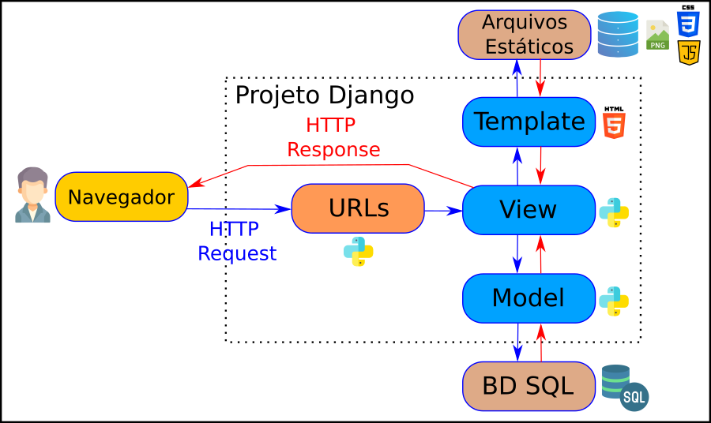
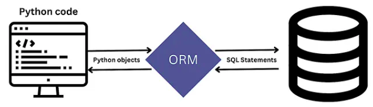
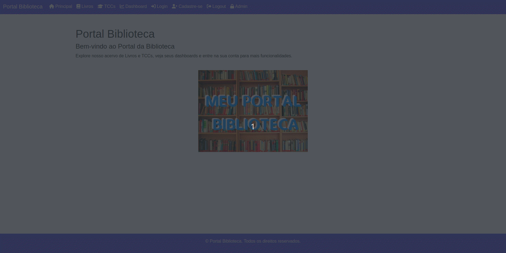

# Aula Django 04 - Sistema para Portal Biblioteca

<p align="center">
  <a href="#">
    
  </a>
  <a href="#">
    
  </a>
  <a href="#">
    
  </a>
</p>

## Índice

* [Introdução](#introdução)
* [Recursos Utilizados](#recursos-utilizados)
* [Fundamentos Teóricos](#fundamentos-teóricos)
* [Objetivo da Aula](#objetivo-da-aula)
* [Desenvolvimento do Projeto](#desenvolvimento-do-projeto)
* [Créditos e Referências](#créditos-e-referências)

## Introdução

<a href="#índice"></a>

O objetivo deste tutorial é criar um sistema para gestão de biblioteca usando o framework Python Django. Esse projeto será utilizado na disciplina GAC116 - Programação Web da Universidade Federal de Lavras (UFLA). Esta aula é uma continuação da Aula Django 03.

Este tutorial foi elaborado com base no tutorial disponível no [curso de Django da W3Schools](https://www.w3schools.com/django/index.php) e na [documentação oficial do Django](https://docs.djangoproject.com/pt-br/5.0/).

A aula está organizada no formato de tutorial, permitindo que cada estudante replique em seu computador os conceitos e recursos apresentados. O código será desenvolvido gradualmente, de modo a evidenciar a evolução da solução e facilitar a compreensão de como as tecnologias Django, HTML, CSS e JavaScript se integram na construção de aplicações web.

## Recursos Utilizados

<a href="#índice"></a>

A seguir estão listados os principais recursos empregados no desenvolvimento desta aula.

### Linguagens

* Python - Linguagem de programação principal
  * [Link do site Python](https://www.python.org/)
  * [Link do curso da W3Schools](https://www.w3schools.com/python/default.asp)
* HTML - Responsável pela estrutura da página web
  * [Link do curso da W3Schools](https://www.w3schools.com/html/default.asp)
* CSS - Responsável pela apresentação da página web
  * [Link do curso da W3Schools](https://www.w3schools.com/css/default.asp)
* JavaScript - Responsável pelo comportamento da página web
  * [Link do curso da W3Schools](https://www.w3schools.com/js/default.asp)
* SQL - Linguagem para consultas no banco de dados
  * [Link do curso da W3Schools](https://www.w3schools.com/sql/default.asp)

### Frameworks

* Django - Framework web
  * [Link do site do Django](https://www.djangoproject.com/)
  * [Link do curso da W3Schools](https://www.w3schools.com/django/index.php)
* Bootstrap - Framework CSS
  * [Link do site do Bootstrap](https://getbootstrap.com/)
  * [Link do curso da W3Schools](https://www.w3schools.com/bootstrap5/index.php)

### Bibliotecas

* Jinja - Biblioteca Python para templates
  * [Link do site do Jinja](https://jinja.palletsprojects.com/en/3.1.x/)
* Chart.js - Biblioteca JavaScript para gráficos
  * [Link do site do chart.js](https://www.chartjs.org/)
* FontAwesome - Biblioteca CSS para ícones
  * [Link do site do Fontawesome](https://fontawesome.com/)
  * [Link da documentação Fontawesome](https://docs.fontawesome.com/web/setup/get-started) 
  * [Link do curso da W3Schools](https://www.w3schools.com/icons/fontawesome5_intro.asp).
* WhiteNoise - Biblioteca Python para servir arquivos estáticos
  * [Link do site do Whitenoise](https://whitenoise.readthedocs.io/)
* Unfold - Biblioteca Python para Interface Administrativa do Django
    * [link do django-unfold](https://unfoldadmin.com/)

### Ferramentas

* Visual Studio Code - Ambiente de desenvolvimento integrado - [link](https://code.visualstudio.com/)
* Git - Sistema de controle de versão - [link](https://git-scm.com/)
* Github - Plataforma de hospedagem e colaboração em projetos de software - [link](https://github.com/)
* Pip - Gerenciador de pacotes do Python - [link](https://pypi.org/project/pip/)
* Venv - Ambiente virtual do Python - [link](https://docs.python.org/pt-br/3/library/venv.html)
* SQLite Online - SGBD - [link](https://sqliteonline.com/)
* DB Browser for SQLite - SGBD - [link](https://sqlitebrowser.org/)

## Fundamentos Teóricos

<a href="#índice"></a>

A seguir estão destacados alguns dos principais fundamentos teóricos para entendimento deste tutorial.

### Características do Django

**1. Framework completo:** Django oferece tudo o que é necessário para o desenvolvimento de uma aplicação web, incluindo roteamento de URLs, Mapeamento Objeto-Relacional (ORM), sistema de templates, autenticação, etc.

**2. Administração automática:** Com base nos modelos definidos, Django gera automaticamente uma interface administrativa poderosa e personalizável, economizando tempo no desenvolvimento de funcionalidades administrativas.

**3. ORM (*Object-Relational Mapping*):** O Django possui um ORM que facilita a interação com bancos de dados relacionais, permitindo que os desenvolvedores escrevam consultas em Python ao invés de SQL.

**4. Sistema de templates:** Django possui um sistema de templates eficiente que permite criar HTML dinâmico de forma organizada, utilizando lógica básica como laços e condicionais.

**5. Segurança embutida:** O Django se preocupa com a segurança, oferecendo proteção contra ataques comuns como SQL *Injection*, *Cross-site Scripting* (XSS), *Cross-site Request Forgery* (CSRF), e *Clickjacking*.

**6. Escalabilidade:** Django é altamente escalável, podendo lidar com grandes volumes de tráfego, como em sites populares que utilizam o framework (por exemplo, Instagram e Pinterest).

**7. Comunidade ativa e documentação:** Django conta com uma ampla comunidade de desenvolvedores e uma documentação completa e detalhada, facilitando a resolução de problemas e o aprendizado.

**8. Reutilização de código:** Django promove a reutilização de componentes por meio de pacotes chamados "apps". Cada app é modular e pode ser usado em diferentes projetos ou em diferentes partes da mesma aplicação.

**9. Suporte a várias bases de dados:** O Django suporta diferentes sistemas de banco de dados, como PostgreSQL, MySQL, SQLite e Oracle, tornando-o flexível para diversos ambientes.

**10. Testes integrados:** O Django tem suporte nativo para testes automatizados, permitindo que desenvolvedores escrevam e executem testes facilmente para garantir a qualidade do código.

### Arquitetura Web de Três Camadas

A arquitetura web de três camadas é um padrão de design de software que organiza uma aplicação em três níveis distintos, cada um com responsabilidades bem definidas. Essas camadas são:

**1. Camada de Apresentação (Frontend)**:

* Também chamada de interface de usuário, essa camada é responsável pela interação com o usuário. Ela inclui tudo o que o usuário vê e utiliza para interagir com o sistema, como páginas web, formulários, botões, e elementos visuais em geral.
* Aqui, são usados tecnologias como HTML, CSS, JavaScript e frameworks frontend (React, Angular, etc.).
* A camada de apresentação envia as entradas dos usuários para a camada de negócios e exibe os resultados de volta para o usuário.

**2. Camada de Negócios (Lógica da Aplicação - Backend)**:

* Nessa camada está a lógica de negócios da aplicação, ou seja, as regras que governam como os dados devem ser processados e as operações que devem ser realizadas. Ela trata os pedidos recebidos da camada de apresentação e executa as operações necessárias.
* Essa camada pode incluir validações, cálculos e chamadas ao banco de dados. Em termos de tecnologia, é geralmente desenvolvida com linguagens de programação como Python, Java, PHP, ou frameworks como Django, Spring Boot, Laravel, etc.

**3. Camada de Dados (Banco de Dados - Backend)**:

* A camada de dados gerencia o armazenamento e recuperação de dados em um banco de dados. Ela é responsável pela persistência dos dados e operações como criar, ler, atualizar e deletar (CRUD).
* Geralmente, são usados sistemas de gerenciamento de banco de dados relacionais (como MySQL, PostgreSQL) ou não relacionais (como MongoDB).
* A camada de negócios interage com essa camada para armazenar e buscar dados conforme necessário.

**Fluxo da Arquitetura de Três Camadas**:

* O usuário interage com a Camada de Apresentação.
* A Camada de Apresentação faz requisições para a Camada de Negócios.
* A Camada de Negócios processa a lógica e, se necessário, interage com a Camada de Dados.
* A Camada de Dados responde com os dados necessários para a Camada de Negócios.
* A Camada de Negócios retorna os resultados processados para a Camada de Apresentação.
* A Camada de Apresentação exibe os resultados para o usuário.

Essa separação facilita a manutenção e escalabilidade da aplicação, permitindo que cada camada possa ser modificada ou melhorada de forma independente.


### Arquitetura MVT do Django

O modelo MVT (*Model-View-Template*) é uma arquitetura usada no framework Django para desenvolvimento de aplicações web. Ele organiza a aplicação em três componentes principais:

* **Model (Modelo)**: Responsável pela definição da estrutura dos dados e a interação com o banco de dados. Ele define as classes que representam as tabelas e seus relacionamentos, além de métodos para realizar consultas e operações nos dados.

* **View (Visão)**: Contém a lógica da aplicação. A view recebe as requisições dos usuários, processa os dados (geralmente acessando o Model), e retorna uma resposta, como uma página HTML renderizada ou dados em formato JSON.

* **Template (Apresentação)**: É a camada de apresentação, onde o conteúdo dinâmico gerado pela View é inserido em arquivos HTML. Os templates permitem a separação da lógica de negócio da interface de usuário, tornando o código mais organizado.

Diferente do padrão MVC, onde o controller gerencia a lógica de controle, no Django, a função das views cumpre esse papel, enquanto os templates gerenciam a apresentação.

A figura abaixo detalha os componentes descritos acima.


No modelo MVT do Django, as requisições seguem um fluxo bem definido, onde cada componente (Model, View, Template) desempenha um papel específico no processamento e resposta de uma requisição HTTP. O fluxo funciona da seguinte forma:

* **Recebimento da Requisição (HTTP Request)**: Quando um usuário acessa uma URL no navegador, o Django recebe a requisição HTTP correspondente. Esse processo começa no URL *dispatcher* (mapeador de URLs), que verifica qual view deve ser chamada com base na URL requisitada.

* **View (Visão)**: A View é o ponto de entrada para o processamento da requisição. A função ou classe associada à URL recebida é executada. Ela é responsável por: Receber a requisição do usuário; Executar a lógica necessária, que pode incluir validações, processamento de dados, ou interações com o banco de dados através dos Models; e Retornar uma resposta apropriada.

* **Model (Modelo)**: Se a View precisar acessar ou manipular dados, ela fará isso por meio do Model. O Model contém a lógica de negócios relacionada à persistência de dados, permitindo a View realizar operações como criar, ler, atualizar ou deletar registros no banco de dados.

* **Template (Apresentação)**: Após processar os dados, a View geralmente prepara um contexto (um dicionário de dados) e passa esse contexto para o Template. O Template é um arquivo HTML com marcações especiais do Django que permitem a inserção de dados dinâmicos. O Template renderiza esses dados em uma estrutura HTML, exibindo o conteúdo adequado com base nas informações passadas pela View.

* **Resposta (HTTP Response)**: Depois que o Template é renderizado, a View retorna uma resposta HTTP (normalmente uma página HTML ou dados JSON em APIs) ao navegador ou cliente. Essa resposta contém o conteúdo processado e visualizado pelo usuário.

A figura abaixo detalha o fluxo descrito acima.


A figura abaixo detalha ainda mais a arquitetura MVT e as tecnologias envolvidas.



### Modelo ORM

O Django suporta o conceito de Mapeamento Objeto-Relacional (ORM). Através do ORM você define a modelagem de dados através de classes em Python. Com isso é possível gerar suas tabelas no banco de dados e manipulá-las sem necessidade de utilizar SQL (o que também é possível). Os registros de cada tabela são representados como instâncias das classes correspondentes. O ORM mapeia os objetos da aplicação para as tabelas do banco de dados, e vice-versa, facilitando o trabalho com dados de banco de dados em um ambiente de programação orientado a objetos.

Em um framework como Django, o ORM é uma parte fundamental. Ele permite que os desenvolvedores definam modelos de dados (classes Python) que representam as tabelas do banco de dados. Esses modelos incluem campos que representam as colunas do banco de dados e métodos que definem o comportamento dos objetos. O ORM traduz as operações realizadas nos objetos (como salvar, atualizar, excluir) em instruções SQL apropriadas para interagir com o banco de dados.

Usando o ORM, os desenvolvedores podem escrever código mais legível, portátil e seguro, pois não precisam lidar diretamente com SQL. Além disso, o ORM facilita a migração entre diferentes sistemas de gerenciamento de banco de dados (como PostgreSQL, MySQL, SQLite) sem a necessidade de alterações significativas no código da aplicação.



Fonte: [https://medium.com/@mochammadagusyahya](https://medium.com/@mochammadagusyahya/mastering-data-magic-unleashing-the-power-of-django-orm-in-your-web-development-journey-62fa851bf49a)

## Objetivo da Aula

<a href="#índice"></a>

O objetivo desta aula é dar continuidade à construção do projeto Portal da Biblioteca utilizando o framework Python Django. Aprenderemos a criar um novo aplicativo para a gestão de usuários cadastrados no sistema. Definiremos as telas de login e cadastro, além da função de logout. Também veremos como disponibilizar conteúdo apenas para usuários autenticados e como criar testes unitários para garantir o funcionamento do sistema. Por fim, abordaremos algumas configurações adicionais do Django, como a adição de novos temas no ambiente administrativo, a implementação de filtros e buscas, bem como a definição do fuso horário do projeto.

A animação abaixo mostra de forma visual o resultado esperado nesta aula.



## Desenvolvimento do Projeto

<a href="#índice"></a>

Siga os passos abaixo para alcançar o objetivo da aula.

### Clonar o Repositório

Para iniciar, faça o clone do repositório com o seguinte comando:

```bash
git clone https://github.com/ufla-prog-web/aula-django-04.git
```

### Abrir o Visual Studio Code

Abra o Visual Studio Code (VS Code) na pasta `aula-django-04`.

**Dica:** abra o arquivo `README.md` e selecione a opção `Open Preview to the Side` para visualizar o tutorial lado a lado enquanto desenvolve a aplicação.

**Dica:** abra um terminal utilizando a IDE clicando em `Terminal` e `New Terminal`.

### Navegar até a Pasta do Projeto

Navegue até a pasta do projeto (`code`) dentro da pasta baixada do Github (`aula-django-04`):

```bash
cd aula-django-04/
cd code/
```

### Criar o Ambiente Virtual

Crie um ambiente virtual para isolar as dependências do projeto:

```bash
python3 -m venv venv
```

**Observação:** no exemplo acima, o segundo nome `venv` é o nome que escolhemos para o nosso ambiente virtual (isso pode ser alterado).

### Ativar o Ambiente Virtual

Ative o ambiente virtual no seu computador utilizando o comando:

```bash
source venv/bin/activate
```

Para sair do ambiente virtual:

```bash
deactivate
```

### Fluxo de Trabalho no Django

A seguir, descreve-se um fluxo de trabalho que pode ser adotado durante o desenvolvimento de projetos com o framework Django.

[](https://mermaid.live/edit#pako:eNqN1E1y2yAUB_CrMHThTVLvveiMbcnfX9Nm0UTKgkrPDikCFZBTNxPfJaseoNMT-GJ9Qq5DNSyqlfjzAwF6wzPNVA60R7dCPWUPTFtyE6WS4NNPUjqVxjLBTj9Pv8GQFWRgzOlVc2ZSek-urz-QAaohBppstHoEq4hUJHpkcqeQNDMNnBxeZL8sA2roVJR0U9q3FRP8B9KOAWu53Jn35aGT0jQ948jhuIUL3Is40-5Zxk6Oaum-3n3zN1CUglkwb3rk9Dik-_pbxffKkNjY06vlmfLGjd24SWs9ew5PreVMHJyGPtCpdHvxU6dnrWlZXnDZOpCZk_P_O725w4sax98hq2xtMyUEZBZ_OO7N1wunl__qgn2Fgu80YiWNz5eOr1rcUfDdyrl14jNdSQN6D7pzKYu1YxtkfYnbMsg-gqmEZbmrtRXbww7ftRvRjNk0Bec3Ir8R-42R3xj7jYnfmNaTN8HnZP1F8x2zp1-aq3tyPB7JbdJdlxmeBRN_f95t3XGHecaM63Bbb_qMPQhAseVC9N6NooEfx-F4FI7H4XgSjqft2O-8u3RGfhyF41k4nofjRThehuOVH9MrWoAuGM_xonquWUrtAxSQ0h6-5rBlWA9YWvIFKaus-nSQGe1ZXcEVrcocKy_iDCuwoL0tEwZTyLlVetlcfu4OfPkDBV6NXw)

### Instalar o Django

Instale o Django dentro do ambiente virtual criado (testado na versão 5.0):

```bash
python3 -m pip install django
```

Verifique a versão instalada:

```bash
django-admin --version
```

ou

```bash
python3 -m django --version
```

**Observação:** caso o terminal não encontre o django-admin, execute o seguinte comando (utilizado geralmente quando não se utiliza o venv):

```bash
export PATH=$PATH:~/.local/bin
```

### Instalar o WhiteNoise

Instale o WhiteNoise dentro do ambiente virtual:

```bash
python3 -m pip install whitenoise
```

### Executar o Projeto

Antes de executar o projeto, aplique as migrações do banco de dados:

```bash
python3 manage.py migrate
```

Em seguida, execute o comando para copiar os arquivos estáticos:

```bash
python3 manage.py collectstatic
```

Inicie a execução do projeto Django:

```bash
python3 manage.py runserver
```

Acesse no navegador a página [http://127.0.0.1:8000/](http://127.0.0.1:8000/).

A aula anterior avançou até aqui.

### Adicionar Controle de Usuários

Esta parte do tutorial foi baseada na [documentação oficial Django](https://docs.djangoproject.com/pt-br/5.0/topics/auth/default/) e também na [videoaula](https://www.youtube.com/watch?v=gdhiA6wObw0).

O Django já oferece diversos recursos prontos para trabalhar com autenticação de usuários e controle de nível de acesso.

Vamos adicionar ao nosso projeto um sistema de gestão de usuários, criando em seguida as telas de login e cadastro.

Para isso, crie uma nova aplicação chamada `usuarios` com o comando:

```bash
python3 manage.py startapp usuarios
```

Em seguida, atualize a lista `INSTALLED_APPS` no arquivo `portal_biblioteca/settings.py`:

```python
...
INSTALLED_APPS = [
    'django.contrib.admin',
    'django.contrib.auth',
    'django.contrib.contenttypes',
    'django.contrib.sessions',
    'django.contrib.messages',
    'django.contrib.staticfiles',
    'biblioteca',
    'usuarios',               #adicone seu app aqui 
]
...
```

Agora, iremos criar uma pasta chamada `templates` dentro da aplicação `usuarios`. Nesta pasta, crie um arquivo chamado `login.html` com o conteúdo:

```html
<h1>Login</h1>
```

Ainda nesta pasta, crie um arquivo chamado `cadastro.html` com o conteúdo:

```html
<h1>Cadastro</h1>
```

Em seguida, precisamos definir as views do nosso sistema de login e cadastro. Assim, no arquivo `usuarios/views.py` digite o código abaixo:

```python
from django.shortcuts import render

def login(request):
    return render(request, 'login.html')

def cadastro(request):
    return render(request, 'cadastro.html')
```

Na pasta `usuarios`, crie o arquivo `urls.py` com o conteúdo abaixo:

```python
from django.urls import path
from . import views

urlpatterns = [
    path('login', views.login, name='login'),
    path('cadastro', views.cadastro, name='cadastro'),
]
```

Agora, precisamos informar a nossa aplicação principal da existência dessas novas URLs. Assim, edite o código `urls.py` da pasta `porta_biblioteca` da seguinte forma:

```python
from django.contrib import admin
from django.urls import include, path

urlpatterns = [
    path('', include('biblioteca.urls')),
    path('admin/', admin.site.urls),
    path('auth/', include('usuarios.urls')),   #linha adicionada
]
```

Reinicie o servidor:

```bash
python3 manage.py runserver
```

Acesse a URL: [http://127.0.0.1:8000/](http://127.0.0.1:8000/). Navegue pelas abas Login e Cadastre-se para visualizar as páginas criadas.

### Melhorar a Tela de Cadastro

Nesta etapa, vamos aprimorar a exibição da tela de Cadastro.

No arquivo `usuarios/templates/cadastro.html`, insira o seguinte código:

```html



    Portal Biblioteca - Cadastro de Usuário



    <main class="container mt-5">
        <center>
            <h1>Cadastre-se</h1>            
            <form action="" method="POST" onsubmit="return validaSenha()">
                
                <div class="input-group">
                    <span class="input-group-text">Usuário: </span>
                    <input type="text" class="form-control" placeholder="Usuário ..." name="usuario" required>
                </div>
                <br>
                <div class="input-group">
                    <span class="input-group-text">E-mail: </span>
                    <input type="email" class="form-control" placeholder="E-mail ..." name="email" required>
                </div>
                <br>
                <div class="input-group">
                    <span class="input-group-text">Senha: </span>
                    <input type="password" class="form-control" placeholder="Senha ..." id="password" name="senha" required>
                    <div class="input-group-append">
                        <button class="btn btn-outline-secondary" type="button" onclick="alterarVisibilidadeSenha('password')">
                            <i class="fa fa-eye"></i>
                        </button>
                    </div>
                </div>
                <br>
                <div class="input-group">
                    <span class="input-group-text">Repetir Senha: </span>
                    <input type="password" class="form-control" placeholder="Repetir Senha ..." id="confirm_password" name="confirma_senha" required>
                    <div class="input-group-append">
                        <button class="btn btn-outline-secondary" type="button" onclick="alterarVisibilidadeSenha('confirm_password')">
                            <i class="fa fa-eye"></i>
                        </button>
                    </div>
                </div>
                <br>
                <div id="passwordError" class="alert alert-danger" style="display: none;">
                    As senhas não coincidem.
                </div>
                <br>
                <button type="submit" class="btn btn-primary">Cadastrar</button>
            </form>
        </center>
    </main>
    <script>
        function alterarVisibilidadeSenha(fieldId) {
            const field = document.getElementById(fieldId);
            if (field.type === "password") {
                field.type = "text";
            } else {
                field.type = "password";
            }
        }
        function validaSenha() {
            const password = document.getElementById("password").value;
            const confirmPassword = document.getElementById("confirm_password").value;
            const errorDiv = document.getElementById("passwordError");

            if (password !== confirmPassword) {
                errorDiv.style.display = "block";
                return false; // Impede o envio do formulário
            } else {
                errorDiv.style.display = "none";
                return true; // Permite o envio do formulário
            }
        }
    </script>

```

Esse código cria um formulário com os seguintes campos: usuário, e-mail, senha, repetir senha e um botão Cadastrar. Ao clicar em Cadastrar, os dados são enviados via método POST para a URL de nome `cadastro` (definida no arquivo `usuarios/urls.py` pela tag `name`). A tag `` é obrigatória para validação de segurança.

**Explicação:** O CSRF Token (*Cross-Site Request Forgery Token*) é um mecanismo de segurança usado para proteger contra ataques de falsificação de requisições entre sites (*CSRF attacks*). Esses ataques exploram o fato de que navegadores enviam automaticamente cookies de sessão em todas as requisições para um domínio, inclusive em solicitações maliciosas. O token garante que apenas requisições legítimas sejam aceitas.

**Atualizando a view cadastro**

No arquivo `usuarios/views.py`, ajuste a função `cadastro` da seguinte forma:

```python
from django.http import HttpResponse
...
def cadastro(request): # atualize essa função
    if request.method == "GET":
        return render(request, 'cadastro.html')
    else: #senão será via método "POST":
        usuario = request.POST.get('usuario')
        email = request.POST.get('email')
        senha = request.POST.get('senha')
        return HttpResponse(usuario)
```

Agora, acesse: [http://127.0.0.1:8000/auth/cadastro](http://127.0.0.1:8000/auth/cadastro). Faça um cadastro e observe o resultado exibido na tela.

Até este ponto, ainda não salvamos os dados no banco de dados; apenas mostramos o valor enviado na tela.

**Salvando dados no banco de dados**

Nesta etapa, iremos inserir as informações cadastradas no BD.

Atualize o código do método `cadastro` no arquivo `usuarios/view.py`.

```python
# faça essas inclusões
from django.contrib.auth.models import User
from django.contrib import messages
...
def cadastro(request):
    if request.method == "GET":
        return render(request, 'cadastro.html')
    else: #senão será via método "POST":
        usuario = request.POST.get('usuario')
        email = request.POST.get('email')
        senha = request.POST.get('senha')

        # Verifica se o usuário já está cadastrado
        user = User.objects.filter(username=usuario).first()
        if user:
            messages.error(request, 'Já existe um usuário com esse nome. Tente novamente.')
            return render(request, 'cadastro.html')

        # Cria e salva o usuário
        user = User.objects.create_user(username=usuario, email=email, password=senha)
        user.save()
        
        return render(request, 'login.html')
```

**Exibindo mensagens de feedback**

No arquivo `usuarios/templates/cadastro.html`, adicione o seguinte trecho após o formulário para exibir mensagens de erro ou sucesso:

```html
...
        </form>
        <!-- Exibe mensagens de erro ou sucesso -->
        <br>
        
            
                <div class="alert alert-successalert-danger" role="alert">
                    {{ message }}
                </div>
            
        
        <!-- Fim do trecho que exibe mensagens -->
    </center>
</main>
...
```

Acesse a URL: [http://127.0.0.1:8000/auth/cadastro](http://127.0.0.1:8000/auth/cadastro). Cadastre um novo usuário e verifique o resultado na tela e também no Django Admin. Tente cadastrar dois usuários com o mesmo nome ou e-mail e analise a mensagem exibida.

**Observação:** o Django não armazena senhas brutas (texto não criptografado) no modelo de usuário. Ele armazena apenas um hash da senha.

Para mais detalhes sobre a classe `User`, consulte a [documentação oficial](https://docs.djangoproject.com/pt-br/5.0/topics/auth/default/).

### Melhorar a Tela de Login

Nesta etapa, vamos aprimorar a exibição da tela de Login.

Atualize o código do arquivo `login.html` para o seguinte:

```html



    Portal Biblioteca - Login



    <main class="container mt-5">
        <center>
            <h1>Login</h1>
            <form action="" method="POST">
                
                <div class="input-group">
                    <span class="input-group-text">Usuário: </span>
                    <input type="text" class="form-control" placeholder="Usuário ..." name="usuario" required>
                </div>
                <br>
                <div class="input-group">
                    <span class="input-group-text">Senha: </span>
                    <input type="password" class="form-control" placeholder="Senha ..." id="password" name="senha" required>
                    <div class="input-group-append">
                        <button class="btn btn-outline-secondary" type="button" onclick="alterarVisibilidadeSenha('password')">
                            <i class="fa fa-eye"></i>
                        </button>
                    </div>
                </div>
                <br>
                <input type="submit" value="Logar" class="btn btn-primary">
            </form>
            <br>
            
                
                    <div class="alert alert-successalert-danger" role="alert">
                        {{ message }}
                    </div>
                
            
        </center>
    </main>
    <script>
        function alterarVisibilidadeSenha(fieldId) {
            const field = document.getElementById(fieldId);
            if (field.type === "password") {
                field.type = "text";
            } else {
                field.type = "password";
            }
        }
    </script>

```

**Atualizando a view login**

No arquivo `usuarios/views.py`, atualize a função `login` conforme abaixo:

```python
# adicione essas importações
from django.contrib.auth import authenticate
from django.contrib.auth import login as login_django
...
def login(request):
    if request.method == "GET":
        return render(request, 'login.html')
    else:
        usuario = request.POST.get('usuario')
        senha = request.POST.get('senha')
        user = authenticate(username=usuario, password=senha)
        if user:
            login_django(request, user)
            return render(request, 'principal.html')
        else:
            messages.error(request, 'Usuário ou senha inválidos. Tente novamente.')
            return render(request, 'login.html')
```

Acesse o endereço: [http://127.0.0.1:8000/auth/login](http://127.0.0.1:8000/auth/login). Faça login com um usuário válido para verificar o acesso. Tente também um login inválido e analise a mensagem de erro exibida.

**Explicação:** As principais diferenças entre "authenticate" e "login" do Django são destacadas a seguir:

* `authenticate`:
    * O método "authenticate" é uma função fornecida pelo Django que é usada para verificar as credenciais de um usuário em um sistema de autenticação.
    * Ele recebe as informações de login do usuário, como nome de usuário e senha, e verifica se essas informações correspondem a um usuário registrado no sistema.
    * Se as credenciais estiverem corretas, o método "authenticate" retornará um objeto de usuário válido que representa o usuário autenticado. Caso contrário, retornará "None".

* `login`:
    * O método "login" refere-se ao processo de estabelecer uma sessão de usuário autenticada em um aplicativo da web após a autenticação bem-sucedida.
    * O Django fornece uma função chamada "login" que permite que você associe um objeto de usuário autenticado a uma sessão. Isso é importante para manter o estado de autenticação do usuário durante a sessão.
    * A função "login" normalmente é usada após o usuário ser autenticado com sucesso usando o "authenticate".

### Exibir Informações do Usuário na Navbar

Nesta etapa, iremos adicionar informações sobre o usuário logado diretamente na navbar do sistema.

Edite o arquivo `biblioteca/templates/base.html` e insira o seguinte trecho de código:

```html
...
    <div>
        ...
        <li class="nav-item">
            <a class="nav-link active" href="/admin"><i class="fa-solid fa-lock"></i> Admin</a>
        </li>
    </ul>
    <!-- Trecho inserido no HTML -->
    <ul class="navbar-nav ms-auto">
        
            <li class="nav-item">
                <a class="nav-link active" href="#"><b>Usuário:</b> {{ user.username }}</a>
            </li>
            <a class="navbar-brand" href="#">
                
            </a>
        
    </ul>
    <!-- Fim do trecho inserido no HTML -->
</div>
```

**Configurando a imagem de avatar**

Copie o arquivo `img_avatar.png` da pasta `docs` para a pasta `staticfiles`.

Em seguida, execute o comando para atualizar os arquivos estáticos:

```bash
python3 manage.py collectstatic
```

Reinicie o servidor:

```bash
python3 manage.py runserver
```

Acesse o endereço [http://127.0.0.1:8000](http://127.0.0.1:8000) e verifique a nova navbar, que agora exibe o nome do usuário logado e o avatar.

**Ajustando a view principal**

Repare que a tela principal não está com a configuração do usuário logado. Para resolver isso, modifique a view principal no arquivo `biblioteca/views.py`:

```python
...
def principal(request):
    template = loader.get_template('principal.html')
    return HttpResponse(template.render({}, request)) # linha atualizada
...
```

Execute novamente o projeto e analise o resultado. Agora, a página principal refletirá corretamente as informações do usuário autenticado.

### Adicionar Logout no Sistema

Agora, vamos incluir em nosso sistema o recurso de logout.

No arquivo `usuarios/views.py`, adicione o seguinte código:

```python
from django.contrib.auth import logout as logout_django
...

def logout(request):
    logout_django(request)
    return render(request, 'login.html')
```

**Explicação:** ao chamar `logout()` do django (ou `logout_django()` neste caso), os dados da sessão atual são completamente limpos. Todos os dados existentes são removidos. Isso evita que outra pessoa use o mesmo navegador para fazer login e ter acesso aos dados da sessão do usuário anterior.

**Definindo a rota de logout**

No arquivo `usuarios/urls.py`, adicione a nova rota.

```python
...
    path('logout', views.logout, name='logout'),
...
```

Reinicie o servidor e acesse o endereço [http://127.0.0.1:8000](http://127.0.0.1:8000). Faça login no sistema. Em seguida, realize o logout. Tente logar novamente e observe como a navbar se comporta após a saída do usuário.

### Disponibilizar o Dashboard Apenas para Usuários Logados

Agora, vamos restringir o acesso ao dashboard, permitindo que ele seja visualizado apenas por usuários que estejam logados na plataforma.

Dessa maneira, atualize o código da função `dashboard` em `biblioteca/view.py` conforme abaixo:

```python
...
def dashboard(request):
    if request.user.is_authenticated:
        qtdLivros = Livro.objects.count()
        qtdTCCs = TCC.objects.count()
        context = {
            'labels': ['Livros', 'TCCs'],
            'data': [qtdLivros, qtdTCCs]
        }
        template = loader.get_template('dashboard.html')
        return HttpResponse(template.render(context, request))
    return HttpResponse("Você precisa estar logado!")
```

Agora, abra uma guia anônima do navegador e acesse [http://127.0.0.1:8000](http://127.0.0.1:8000). Tente acessar a tela de dashboard sem login, então você verá a mensagem de bloqueio. Faça login e tente novamente, então o dashboard será exibido corretamente.

**Usando o decorador login_required**

Uma outra forma de fazer a mesma operação é utilizando o decorador `login_required`. Atualize o seu código da função dashborad em `biblioteca/view.py` para o seguinte:

```python
from django.contrib.auth.decorators import login_required
...
@login_required(login_url="/auth/login")
def dashboard(request):
    qtdLivros = Livro.objects.count()
    qtdTCCs = TCC.objects.count()
    context = {
        'labels': ['Livros', 'TCCs'],
        'data': [qtdLivros, qtdTCCs]
    }
    template = loader.get_template('dashboard.html')
    return HttpResponse(template.render(context, request))
```

Em seguida, abra uma guia anônima do navegador e acesse o endereço [http://127.0.0.1:8000](http://127.0.0.1:8000). Tente acessar a tela de dashboard. Perceba que portal redireciona para a tela de login, isso ocorre, pois colocamos isso no parâmetro `login_url`. Na sequência, faça login na plataforma e então tente acessar o dashboard.

Esse ajuste garante que apenas usuários autenticados tenham acesso ao dashboard, aumentando a segurança do sistema.

### Incluir Testes Unitários

Nesta etapa, iremos incluir testes de software no projeto. O Django oferece uma estrutura robusta por meio do módulo `django.test`, que permite criar testes para verificar o comportamento da aplicação, garantindo que as funcionalidades implementadas funcionem conforme o esperado.

O Django utiliza o módulo `unittest` do Python, que permite a criação de classes de teste. Por padrão, o Django criará um banco de dados temporário para os testes, garantindo que o banco de dados principal não seja afetado.

Em Django, os testes geralmente são colocados no arquivo `tests.py` dentro de cada aplicativo (app). A estrutura básica para criar um teste em Django é a seguinte:

1. Importar TestCase do módulo `django.test`.
2. Criar uma classe de teste que herda de `TestCase`.
3. Escrever métodos de teste dentro dessa classe. Cada método deve começar com `test_`.

**Exemplo de teste de modelos**

No arquivo `biblioteca/tests.py`, adicione o seguinte código:

```python
from django.test import TestCase
from .models import Livro
from .models import TCC

class ModeloTestCase(TestCase):
    def setUp(self):
        Livro.objects.create(nome="Introdução ao Django", autor="João Silva", ano=2024)
        TCC.objects.create(titulo="Análise de Sistemas Web", autor="José Carvalho", orientador="Prof. Carlos Souza", ano=2023)

    def test_criacao_e_conteudo_livro(self):
        livro = Livro.objects.get(nome="Introdução ao Django")
        self.assertEqual(livro.autor, "João Silva")
        self.assertEqual(livro.ano, 2024)

    def test_criacao_e_conteudo_tcc(self):
        tcc = TCC.objects.get(titulo="Análise de Sistemas Web")
        self.assertEqual(tcc.autor, "José Carvalho")
        self.assertEqual(tcc.orientador, "Prof. Carlos Souza")
        self.assertEqual(tcc.ano, 2023)
```

**Explicação**:

* `setUp`: Esse método é executado antes de cada teste e é útil para configurar dados de teste, como a criação de objetos no banco de dados.
* **Método de Teste**: Cada método de teste deve começar com `test_` e testar uma funcionalidade específica. Nesse exemplo, o método `test_criacao_e_conteudo_livro` verifica se o livro foi criado com o autor e ano correto.
* **Assertions**: `self.assertEqual` é uma das muitas "assertions" disponíveis para verificar condições nos testes. Outras comuns incluem `self.assertTrue`, `self.assertFalse`, `self.assertIn`, entre outras.

Em seguida, execute o teste:

```bash
python manage.py test
```

**Exemplo de teste de view**

O Django permite simular requisições HTTP usando o cliente de testes (`self.client`). Para testar uma view, como, por exemplo, uma página de detalhe de um TCC, no mesmo arquivo `biblioteca/tests.py`, adicione:

```python
...
from django.urls import reverse
...
class ViewTCCTestCase(TestCase):
    def setUp(self):
        self.tcc = TCC.objects.create(titulo="Análise de Interfaces Web", autor="Cesar Silva", orientador="Prof. Ricardo Souza", ano=2022)

    def test_view_tcc_detalhes(self):
        url = reverse("tcc_detalhes", args=[self.tcc.id])
        response = self.client.get(url)
        #print(url)
        #print(response.content.decode("utf-8"))
        self.assertEqual(response.status_code, 200)
        self.assertContains(response, "Análise de Interfaces Web")
```

**Explicação**: Neste exemplo, o teste verifica se a página de detalhes do TCC é acessada corretamente e contém o título do TCC. O comando `reverse` é utilizado para resolver o caminho de uma URL com base no nome dado a ela no arquivo de configuração de URLs (`biblioteca/urls.py`).

Em seguida, execute o teste:

```bash
python manage.py test
```

**Dica:** habilite os prints comentados no método `test_view_tcc_detalhes` para inspecionar a saída gerada.

### Opção1: Mudar o Tema do Ambiente Administrativo para Grappelli

A seguir será mostrado três opções de temas (Grappelli, Jazzmin e Unfold) para você configurar o ambiente administrativo. Escolha apenas uma opção para fazer.

Nesta etapa, vamos alterar o tema padrão do ambiente administrativo do Django para o Grappelli, que oferece uma interface bem polida, visual clássico, mais "clean" porém com estilo tradicional. Oferece diversas customizações no tema, dashboard, ordenação inline, autocomplete.

Para isso, instale o Grappelli do Django utilizando o comando abaixo:

```bash
python3 -m pip install django-grappelli
```

Em seguida, inclua o Grappelli na variável `INSTALLED_APPS` em `portal_biblioteca/settings.py` conforme abaixo:

```python
...
INSTALLED_APPS = [
    'grappelli',     # incluir para usar o tema grappelli 
    'django.contrib.admin',
    ...
]
...
```

No arquivo `portal_biblioteca/urls.py`, adicione as URLs do Grappelli antes das do admin:

```python
...
urlpatterns = [
    path('grappelli/', include('grappelli.urls')),  # URL do Grappelli
    path('', include('biblioteca.urls')),
    path('admin/', admin.site.urls),
    path('auth/', include('usuarios.urls')),
]
...
```

Execute o comando:

```bash
python3 manage.py migrate
```

Execute a aplicação:

```bash
python3 manage.py runserver
```

Para mais informações sobre o Grappelli, consulte a [documentação oficial](https://django-grappelli.readthedocs.io/).

### Opção2: Mudar o Tema do Ambiente Administrativo para Jazzmin

Nesta etapa, vamos alterar o tema padrão do ambiente administrativo do Django para o Jazzmin, que oferece uma interface mais moderna, robusta e visualmente atraente.

Para isso, instale o Jazzmin do Django utilizando o comando abaixo:

```bash
python3 -m pip install django-jazzmin
```

Em seguida, inclua o jazzmin na variável `INSTALLED_APPS` em `portal_biblioteca/settings.py` conforme abaixo:

```python
...
INSTALLED_APPS = [
    'jazzmin',      # incluir para usar o tema jazzmin 
    'django.contrib.admin',
    'django.contrib.auth',
    ...
]
...
```

Se desejar, você pode personalizar o visual no `portal_biblioteca/settings.py` com as variáveis `JAZZMIN_SETTINGS` e `JAZZMIN_UI_TWEAKS`.

```python
...

JAZZMIN_SETTINGS = {
    "site_title": "Portal Biblioteca",
    "site_header": "Administração Biblioteca",
    "site_brand": "Portal Biblioteca",
    "welcome_sign": "Bem-vindo ao ambiente de gestão do Portal da Biblioteca",
    "copyright": "Universidade Federal de Lavras",
}

JAZZMIN_UI_TWEAKS = {
    "theme": "cosmo",   # opções: cosmo, flatly, cyborg, lumen, etc (temas do Bootswatch)
    "navbar": "navbar-dark bg-primary",
    "sidebar": "sidebar-dark-primary",
    "footer_fixed": True,
}
```

**Atenção:** Para informações sobre os valores da variável `theme`, veja [site do Bootswatch](https://bootswatch.com/).

Execute a aplicação:

```bash
python3 manage.py runserver
```

Para mais informações sobre o Jazzmin, consulte a [documentação oficial](https://django-jazzmin.readthedocs.io/).

### Opção3: Mudar o Tema do Ambiente Administrativo para Unfold

Nesta etapa, vamos alterar o tema padrão do ambiente administrativo do Django para o Unfold, que oferece uma interface mais moderna, robusta e visualmente atraente.

Para isso, instale o unfold do Django utilizando o comando abaixo:

```bash
python3 -m pip install django-unfold
```

Em seguida, inclua o Unfold na variável `INSTALLED_APPS` em `portal_biblioteca/settings.py` conforme abaixo:

```python
...
INSTALLED_APPS = [
    'unfold',      # incluir para usar o tema unfold 
    'django.contrib.admin',
    'django.contrib.auth',
    ...
]
...
```

Execute o comando:

```bash
python3 manage.py collectstatic
```

Execute a aplicação:

```bash
python3 manage.py runserver
```

Para mais informações sobre o Unfold, consulte a [documentação oficial](https://unfoldadmin.com/docs/installation/quickstart/).

### Incluir Busca nas Tabelas do Ambiente Adminstrativo

Nesta etapa, iremos adicionar um campo de busca no ambiente administrativo para facilitar o filtro de dados. Esse recurso é especialmente útil para campos de texto, mas também pode ser aplicado a valores numéricos, como o campo ano.

Atualize o código do arquivo `biblioteca/admin.py` conforme o exemplo abaixo.

```python
...
class LivroAdmin(admin.ModelAdmin):
    list_display = ("nome", "autor", "ano")
    search_fields = ("nome", "autor") # campo de busca

class TCCAdmin(admin.ModelAdmin):
    list_display = ("titulo", "autor", "orientador", "ano")
    search_fields = ("titulo", "autor", "orientador") # campo de busca
...
```

Execute a aplicação:

```bash
python3 manage.py runserver
```

Acesse o ambiente administrativo em [http://127.0.0.1:8000/admin/](http://127.0.0.1:8000/admin/) e realize buscas nas tabelas Livro e TCC.

### Incluir Filtros nas Tabelas do Ambiente Adminstrativo

Agora, vamos adicionar filtros no ambiente administrativo. Esse recurso aparece na barra lateral e permite filtrar registros com base em determinados campos. É especialmente útil para campos com valores repetitivos, como status ou categoria.

Atualize o código do arquivo `biblioteca/admin.py` conforme o exemplo abaixo:

```python
...
class LivroAdmin(admin.ModelAdmin):
    list_display = ("nome", "autor", "ano")
    search_fields = ("nome", "autor")
    list_filter = ("autor", "ano") # campos para filtro

class TCCAdmin(admin.ModelAdmin):
    list_display = ("titulo", "autor", "orientador", "ano")
    search_fields = ("titulo", "autor", "orientador")
    list_filter = ("autor", "orientador", "ano") # campos para filtro
...
```

Execute a aplicação:

```bash
python3 manage.py runserver
```

Reinicie a aplicação e acesse o ambiente administrativo [http://127.0.0.1:8000/admin/](http://127.0.0.1:8000/admin/). Em seguida, utilize os filtros nas tabelas Livro e TCC.

### Adicionar Outros Detalhes no Admin.py

Nesta etapa, iremos incluir mais algumas personalizações no ambiente administrativo:

* Ordenação padrão dos registros exibidos.
* Edição direta de campos na lista de itens.
* Customização de títulos do painel administrativo.

Assim, inclua as seguintes modificações no arquivo `biblioteca/admin.py`:

```python
...
class TCCAdmin(admin.ModelAdmin):
    ...
    ordering = ('autor',)    # para ordenação inicial dos dados
    list_editable = ('ano',) # para edição dos campos diretamente na lista de itens
...
admin.site.site_header = "Administração da Biblioteca"
admin.site.index_title = "Bem-vindo a Administração do Portal Biblioteca"
```

Execute novamente a aplicação e verifique as alterações no ambiente administrativo.

### Configurar o Fuso Horário do Brasil

Por fim, vamos configurar o fuso horário padrão da aplicação para São Paulo (mesmo utilizado em MG).

No arquivo `portal_biblioteca/settings.py`, atualize a variável `TIME_ZONE`:

```python
...
TIME_ZONE = 'America/Sao_Paulo'
...
```

O atributo `TIME_ZONE` especifica em qual fuso horário o Django deve armazenar e manipular dados de data e hora no banco de dados, além de exibir essas informações nas views e na interface de administração. O [link](https://github.com/guilhermeonrails/language_code_django/blob/tz_list/list.py) trás uma lista com as opções disponíveis de fuso horário.

Reinicie o servidor, faça uma atualização em qualquer registro pelo ambiente administrativo e observe como as mudanças aparecem corretamente na seção Ações recentes.

Para mais informações sobre as configurações disponíveis no arquivo de `settings.py`, consulte a [documentação oficial do Django](https://docs.djangoproject.com/en/5.1/ref/settings/).

## Créditos e Referências

<a href="#índice"></a>

Este tutorial foi inspirado nos seguintes materiais:

* [Documentação oficial do Django](https://docs.djangoproject.com/pt-br/5.0/)
* [Curso de Django da W3Schools](https://www.w3schools.com/django/index.php)
