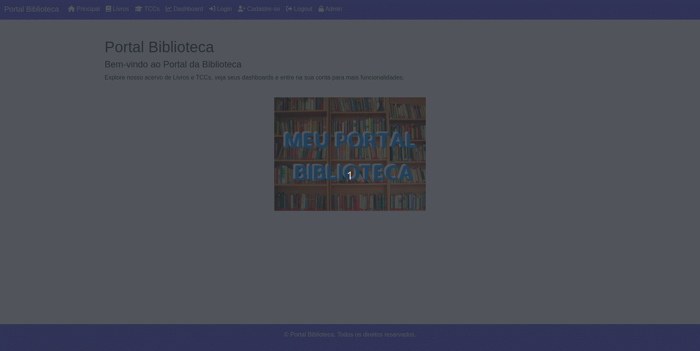
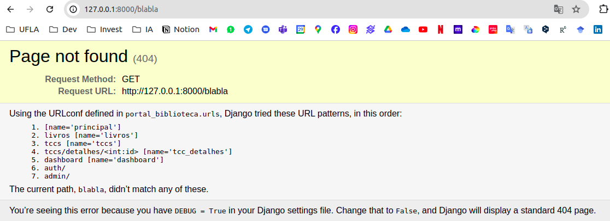
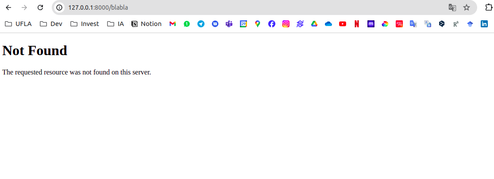
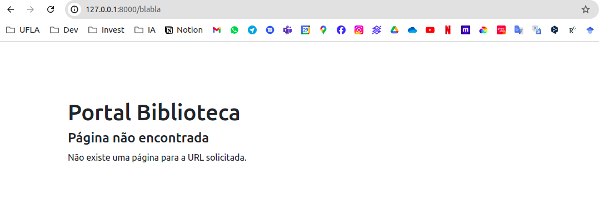
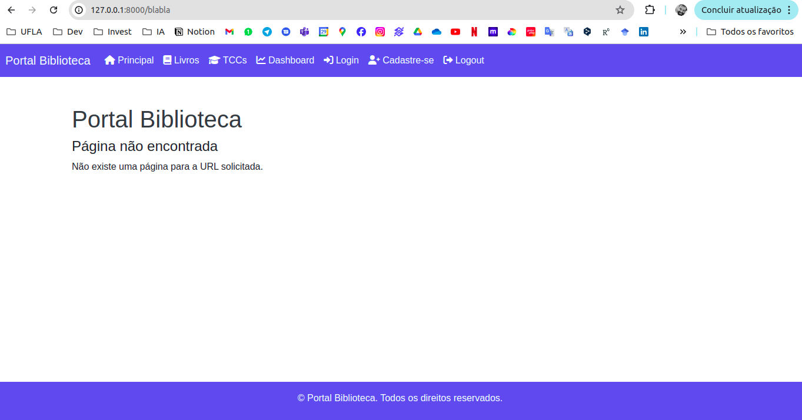

# Aula Django 04 - Sistema para Portal Biblioteca

<p align="center">
  <a href="#">
    
  </a>
  <a href="#">
    
  </a>
  <a href="#">
    
  </a>
</p>

## Índice

* [Introdução](#introdução)
* [Recursos Utilizados](#recursos-utilizados)
* [Objetivo da Aula](#objetivo-da-aula)
* [Desenvolvimento do Projeto](#desenvolvimento-do-projeto)
* [Referências e Materiais de Apoio](#referências-e-materiais-de-apoio)

## Introdução

<a href="#índice"></a>

O objetivo deste tutorial é criar um sistema para gestão de biblioteca usando o framework Python Django. Esse projeto será utilizado na disciplina GAC116 - Programação Web da Universidade Federal de Lavras (UFLA). Esta aula é uma continuação da Aula Django 03.

Este tutorial foi elaborado com base no tutorial disponível no [curso de Django da W3Schools](https://www.w3schools.com/django/index.php) e na [documentação oficial do Django](https://docs.djangoproject.com/pt-br/6.1/).

A aula está organizada no formato de tutorial, permitindo que cada estudante replique em seu computador os conceitos e recursos apresentados. O código será desenvolvido gradualmente, de modo a evidenciar a evolução da solução e facilitar a compreensão de como as tecnologias Django, HTML, CSS e JavaScript se integram na construção de aplicações web.

## Recursos Utilizados

<a href="#índice"></a>

A seguir estão listados os principais recursos empregados no desenvolvimento desta aula.

### Linguagens

* Python - Linguagem de programação principal
  * [Link do site Python](https://www.python.org/)
  * [Link do curso da W3Schools](https://www.w3schools.com/python/default.asp)
* HTML - Responsável pela estrutura da página web
  * [Link do curso da W3Schools](https://www.w3schools.com/html/default.asp)
* CSS - Responsável pela apresentação da página web
  * [Link do curso da W3Schools](https://www.w3schools.com/css/default.asp)
* JavaScript - Responsável pelo comportamento da página web
  * [Link do curso da W3Schools](https://www.w3schools.com/js/default.asp)
* SQL - Linguagem para consultas no banco de dados
  * [Link do curso da W3Schools](https://www.w3schools.com/sql/default.asp)

### Frameworks

* Django - Framework web
  * [Link do site do Django](https://www.djangoproject.com/)
  * [Link do curso da W3Schools](https://www.w3schools.com/django/index.php)
* Bootstrap - Framework CSS
  * [Link do site do Bootstrap](https://getbootstrap.com/)
  * [Link do curso da W3Schools](https://www.w3schools.com/bootstrap5/index.php)

### Bibliotecas

* Jinja - Biblioteca Python para templates
  * [Link do site do Jinja](https://jinja.palletsprojects.com/en/3.1.x/)
* Chart.js - Biblioteca JavaScript para gráficos
  * [Link do site do chart.js](https://www.chartjs.org/)
* FontAwesome - Biblioteca CSS para ícones
  * [Link do site do Fontawesome](https://fontawesome.com/)
  * [Link da documentação Fontawesome](https://docs.fontawesome.com/web/setup/get-started)
  * [Link do curso da W3Schools](https://www.w3schools.com/icons/fontawesome5_intro.asp)
* WhiteNoise - Biblioteca Python para servir arquivos estáticos
  * [Link do site do Whitenoise](https://whitenoise.readthedocs.io/)
* Grappelli - Biblioteca Python para Interface Administrativa do Django
  * [link do django-grappelli](https://django-grappelli.readthedocs.io/)
* Jazzmin - Biblioteca Python para Interface Administrativa do Django
  * [link do django-jazzmin](https://django-jazzmin.readthedocs.io/)
* Unfold - Biblioteca Python para Interface Administrativa do Django
  * [link do django-unfold](https://unfoldadmin.com/)

### Ferramentas

* Visual Studio Code - Ambiente de Desenvolvimento Integrado
  * [Link site Visual Studio](https://code.visualstudio.com/)
* Git - Sistema de controle de versão
  * [Link site do Git](https://git-scm.com/)
* Github - Plataforma de hospedagem e colaboração em projetos de software
  * [Link site do Github](https://github.com/)
* Pip - Gerenciador de pacotes do Python
  * [Link site do Pip](https://pypi.org/project/pip/)
* Venv - Ambiente virtual do Python
  * [Link site do Venv](https://docs.python.org/pt-br/3/library/venv.html)
* SQLite Online - SGBD
  * [Link site SQLite Online](https://sqliteonline.com/)
* DB Browser for SQLite - SGBD
  * [Link site SQLite Browser](https://sqlitebrowser.org/)

## Objetivo da Aula

<a href="#índice"></a>

O objetivo desta aula é dar continuidade à construção do projeto Portal da Biblioteca utilizando o framework Python Django. Aprenderemos a criar um novo aplicativo para a gestão de usuários cadastrados no sistema. Definiremos as telas de login e cadastro, além da função de logout. Também veremos como disponibilizar conteúdo apenas para usuários autenticados e como criar testes unitários para garantir o funcionamento do sistema. Por fim, abordaremos algumas configurações adicionais do Django, como a adição de novos temas no ambiente administrativo, a implementação de filtros e buscas, bem como a definição do fuso horário do projeto.

A animação abaixo mostra de forma visual o resultado esperado nesta aula.



## Desenvolvimento do Projeto

<a href="#índice"></a>

Siga os passos abaixo para alcançar o objetivo da aula.

### Clonar o Repositório

Para iniciar, faça o clone do repositório com o seguinte comando:

```bash
git clone https://github.com/ufla-prog-web/aula-django-04.git
```

### Abrir o Visual Studio Code

Abra o Visual Studio Code (VS Code) na pasta `aula-django-04`.

**Dica:** abra o arquivo `README.md` e selecione a opção `Open Preview to the Side` para visualizar o tutorial lado a lado enquanto desenvolve a aplicação.

**Dica:** abra um terminal utilizando a IDE clicando em `Terminal` e `New Terminal`.

### Navegar até a Pasta do Projeto

Navegue até a pasta do projeto (`code`) dentro da pasta baixada do Github (`aula-django-04`):

```bash
cd aula-django-04/
cd code/
```

### Criar o Ambiente Virtual

Crie um ambiente virtual para isolar as dependências do projeto:

```bash
python3 -m venv venv
```

**Observação:** no exemplo acima, o segundo nome `venv` é o nome que escolhemos para o nosso ambiente virtual (isso pode ser alterado).

### Ativar o Ambiente Virtual

Ative o ambiente virtual no seu computador utilizando o comando:

```bash
source venv/bin/activate
```

### Instalar o Django

Instale o Django dentro do ambiente virtual criado (testado na versão 5.0):

```bash
python3 -m pip install django
```

Verifique a versão instalada:

```bash
django-admin --version
```

ou

```bash
python3 -m django --version
```

**Observação:** caso o terminal não encontre o django-admin, execute o seguinte comando (utilizado geralmente quando não se utiliza o venv):

```bash
export PATH=$PATH:~/.local/bin
```

### Executar o Projeto

Antes de executar o projeto, aplique as migrações do banco de dados:

```bash
python3 manage.py migrate
```

Em seguida, execute o comando para copiar os arquivos estáticos:

```bash
python3 manage.py collectstatic
```

Inicie a execução do projeto Django:

```bash
python3 manage.py runserver
```

Acesse no navegador a página [http://127.0.0.1:8000/](http://127.0.0.1:8000/).

A aula anterior avançou até aqui.

### Adicionar Controle de Usuários

O Django já oferece diversos recursos prontos para trabalhar com autenticação de usuários e controle de nível de acesso.

Vamos adicionar ao nosso projeto um aplicativo de gestão de usuários, criando em seguida as telas de login e cadastro.

Para isso, crie uma nova aplicação chamada `usuarios` com o comando:

```bash
python3 manage.py startapp usuarios
```

Em seguida, atualize a lista `INSTALLED_APPS` no arquivo `portal_biblioteca/settings.py`:

```python
...
INSTALLED_APPS = [
    'django.contrib.admin',
    'django.contrib.auth',
    'django.contrib.contenttypes',
    'django.contrib.sessions',
    'django.contrib.messages',
    'django.contrib.staticfiles',
    'biblioteca',
    'usuarios',               #adicone seu app aqui 
]
...
```

Agora, iremos criar uma pasta chamada `templates` dentro da aplicação `usuarios`. Nesta pasta, crie um arquivo chamado `login.html` com o conteúdo:

```html
<!DOCTYPE html>
<html>
    <head>
        <meta charset="utf-8">
        <title>Portal Biblioteca - Login</title>
    </head>
    <body>
        <h1>Login</h1>
    </body>
</html>
```

Ainda nesta pasta, crie um arquivo chamado `cadastro.html` com o conteúdo:

```html
<!DOCTYPE html>
<html>
    <head>
        <meta charset="utf-8">
        <title>Portal Biblioteca - Cadastro de Usuário</title>
    </head>
    <body>
        <h1>Cadastro</h1>
    </body>
</html>
```

Em seguida, precisamos definir as views do nosso sistema de login e cadastro. Assim, no arquivo `usuarios/views.py` digite o código abaixo:

```python
from django.shortcuts import render

def login(request):
    return render(request, 'login.html')

def cadastro(request):
    return render(request, 'cadastro.html')
```

Na pasta `usuarios`, crie o arquivo `urls.py` com o conteúdo abaixo:

```python
from django.urls import path
from . import views

urlpatterns = [
    path('login', views.login, name='login'),
    path('cadastro', views.cadastro, name='cadastro'),
]
```

Agora, precisamos informar a nossa aplicação principal da existência dessas novas URLs. Assim, edite o código `urls.py` da pasta `portal_biblioteca` da seguinte forma:

```python
from django.contrib import admin
from django.urls import include, path

urlpatterns = [
    path('', include('biblioteca.urls')),
    path('admin/', admin.site.urls),
    path('auth/', include('usuarios.urls')),   #linha adicionada
]
```

Reinicie o servidor:

```bash
python3 manage.py runserver
```

Acesse a URL: [http://127.0.0.1:8000/](http://127.0.0.1:8000/). Navegue pelas abas Login e Cadastre-se para visualizar as páginas criadas.

### Melhorar a Tela de Cadastro

Nesta etapa, vamos aprimorar a exibição da tela de Cadastro.

No arquivo `usuarios/templates/cadastro.html`, insira o seguinte código:

```html



    Portal Biblioteca - Cadastro de Usuário



    <main class="container mt-5">
        <center>
            <h1>Cadastre-se</h1>            
            <form action="" method="POST" onsubmit="return validaSenha()">
                
                <div class="input-group">
                    <span class="input-group-text">Usuário: </span>
                    <input type="text" class="form-control" placeholder="Usuário ..." name="usuario" required>
                </div>
                <br>
                <div class="input-group">
                    <span class="input-group-text">E-mail: </span>
                    <input type="email" class="form-control" placeholder="E-mail ..." name="email" required>
                </div>
                <br>
                <div class="input-group">
                    <span class="input-group-text">Senha: </span>
                    <input type="password" class="form-control" placeholder="Senha ..." id="password" name="senha" required>
                    <div class="input-group-append">
                        <button class="btn btn-outline-secondary" type="button" onclick="alterarVisibilidadeSenha('password')">
                            <i class="fa fa-eye"></i>
                        </button>
                    </div>
                </div>
                <br>
                <div class="input-group">
                    <span class="input-group-text">Repetir Senha: </span>
                    <input type="password" class="form-control" placeholder="Repetir Senha ..." id="confirm_password" name="confirma_senha" required>
                    <div class="input-group-append">
                        <button class="btn btn-outline-secondary" type="button" onclick="alterarVisibilidadeSenha('confirm_password')">
                            <i class="fa fa-eye"></i>
                        </button>
                    </div>
                </div>
                <br>
                <div id="passwordError" class="alert alert-danger" style="display: none;">
                    As senhas não coincidem.
                </div>
                <br>
                <button type="submit" class="btn btn-primary">Cadastrar</button>
            </form>
        </center>
    </main>
    <script>
        function alterarVisibilidadeSenha(fieldId) {
            const field = document.getElementById(fieldId);
            if (field.type === "password") {
                field.type = "text";
            } else {
                field.type = "password";
            }
        }
        function validaSenha() {
            const password = document.getElementById("password").value;
            const confirmPassword = document.getElementById("confirm_password").value;
            const errorDiv = document.getElementById("passwordError");

            if (password !== confirmPassword) {
                errorDiv.style.display = "block";
                return false; // Impede o envio do formulário
            } else {
                errorDiv.style.display = "none";
                return true; // Permite o envio do formulário
            }
        }
    </script>

```

Esse código cria um formulário com os seguintes campos: usuário, e-mail, senha, repetir senha e um botão Cadastrar. Ao clicar em Cadastrar, os dados são enviados via método POST para a URL de nome `cadastro` (definida no arquivo `usuarios/urls.py` pela tag `name`). A tag `` é obrigatória para validação de segurança.

**Explicação:** O CSRF Token (*Cross-Site Request Forgery Token*) é um mecanismo de segurança usado para proteger contra ataques de falsificação de requisições entre sites (*CSRF attacks*). Esses ataques exploram o fato de que navegadores enviam automaticamente cookies de sessão em todas as requisições para um domínio, inclusive em solicitações maliciosas. O token garante que apenas requisições legítimas sejam aceitas.

**Atualizando a view cadastro**

No arquivo `usuarios/views.py`, ajuste a função `cadastro` da seguinte forma:

```python
from django.http import HttpResponse
...
def cadastro(request): # atualize essa função
    if request.method == "GET":
        return render(request, 'cadastro.html')
    else: #senão será via método "POST":
        usuario = request.POST.get('usuario')
        email = request.POST.get('email')
        senha = request.POST.get('senha')
        return HttpResponse(usuario)
```

Agora, acesse: [http://127.0.0.1:8000/auth/cadastro](http://127.0.0.1:8000/auth/cadastro). Faça um cadastro e observe o resultado exibido na tela.

Até este ponto, ainda não salvamos os dados no banco de dados; apenas mostramos o valor enviado na tela.

**Salvando dados no banco de dados**

Nesta etapa, iremos inserir as informações cadastradas no BD.

Atualize o código do método `cadastro` no arquivo `usuarios/views.py`.

```python
# faça essas inclusões
from django.contrib.auth.models import User
from django.contrib import messages
...
def cadastro(request):
    if request.method == "GET":
        return render(request, 'cadastro.html')
    else: #senão será via método "POST":
        usuario = request.POST.get('usuario')
        email = request.POST.get('email')
        senha = request.POST.get('senha')

        # Verifica se o usuário já está cadastrado
        user = User.objects.filter(username=usuario).first()
        if user:
            # Exibe uma mensagem de erro se o usuário já existir
            messages.error(request, 'Já existe um usuário com esse nome. Tente novamente.')
            return render(request, 'cadastro.html')
        else:
            # Cria e salva o usuário
            user = User.objects.create_user(username=usuario, email=email, password=senha)
            user.save()
            messages.success(request, 'Usuário cadastrado com sucesso!')
            return render(request, 'cadastro.html')
```

**Exibindo mensagens de feedback**

No arquivo `usuarios/templates/cadastro.html`, adicione o seguinte trecho após o formulário para exibir mensagens de erro ou sucesso:

```html
...
        </form>
        <!-- Exibe mensagens de erro ou sucesso -->
        <br>
        
            
                <div class="alert alert-successalert-danger" role="alert">
                    {{ message }}
                </div>
            
        
        <!-- Fim do trecho que exibe mensagens -->
    </center>
</main>
...
```

Acesse a URL: [http://127.0.0.1:8000/auth/cadastro](http://127.0.0.1:8000/auth/cadastro). Cadastre um novo usuário e verifique o resultado na tela e também no Django Admin. Tente cadastrar dois usuários com o mesmo nome ou e-mail e analise a mensagem exibida.

**Observação:** o Django não armazena senhas brutas (texto não criptografado) no modelo de usuário. Ele armazena apenas um hash da senha.

Para mais detalhes sobre a classe `User`, consulte a [documentação oficial](https://docs.djangoproject.com/pt-br/6.1/topics/auth/default/).

### Melhorar a Tela de Login

Nesta etapa, vamos aprimorar a exibição da tela de Login.

Atualize o código do arquivo `login.html` para o seguinte:

```html



    Portal Biblioteca - Login



    <main class="container mt-5">
        <center>
            <h1>Login</h1>
            <form action="" method="POST">
                
                <div class="input-group">
                    <span class="input-group-text">Usuário: </span>
                    <input type="text" class="form-control" placeholder="Usuário ..." name="usuario" required>
                </div>
                <br>
                <div class="input-group">
                    <span class="input-group-text">Senha: </span>
                    <input type="password" class="form-control" placeholder="Senha ..." id="password" name="senha" required>
                    <div class="input-group-append">
                        <button class="btn btn-outline-secondary" type="button" onclick="alterarVisibilidadeSenha('password')">
                            <i class="fa fa-eye"></i>
                        </button>
                    </div>
                </div>
                <br>
                <input type="submit" value="Logar" class="btn btn-primary">
            </form>
            <br>
            
                
                    <div class="alert alert-successalert-danger" role="alert">
                        {{ message }}
                    </div>
                
            
        </center>
    </main>
    <script>
        function alterarVisibilidadeSenha(fieldId) {
            const field = document.getElementById(fieldId);
            if (field.type === "password") {
                field.type = "text";
            } else {
                field.type = "password";
            }
        }
    </script>

```

**Atualizando a view login**

No arquivo `usuarios/views.py`, atualize a função `login` conforme abaixo:

```python
# adicione essas importações
from django.contrib.auth import authenticate
from django.contrib.auth import login as login_django
...
def login(request):
    if request.method == "GET":
        return render(request, 'login.html')
    else:
        usuario = request.POST.get('usuario')
        senha = request.POST.get('senha')
        user = authenticate(username=usuario, password=senha)
        if user:
            login_django(request, user)
            return render(request, 'principal.html')
        else:
            messages.error(request, 'Usuário ou senha inválidos. Tente novamente.')
            return render(request, 'login.html')
```

Acesse o endereço: [http://127.0.0.1:8000/auth/login](http://127.0.0.1:8000/auth/login). Faça login com um usuário válido para verificar o acesso. Tente também um login inválido e analise a mensagem de erro exibida.

**Explicação:** As principais diferenças entre "authenticate" e "login" do Django são destacadas a seguir:

* `authenticate`:
    * O método "authenticate" é uma função fornecida pelo Django que é usada para verificar as credenciais de um usuário em um sistema de autenticação.
    * Ele recebe as informações de login do usuário, como nome de usuário e senha, e verifica se essas informações correspondem a um usuário registrado no sistema.
    * Se as credenciais estiverem corretas, o método "authenticate" retornará um objeto de usuário válido que representa o usuário autenticado. Caso contrário, retornará "None".

* `login`:
    * O método "login" refere-se ao processo de estabelecer uma sessão de usuário autenticada em um aplicativo da web após a autenticação bem-sucedida.
    * O Django fornece uma função chamada "login" que permite que você associe um objeto de usuário autenticado a uma sessão. Isso é importante para manter o estado de autenticação do usuário durante a sessão.
    * A função "login" normalmente é usada após o usuário ser autenticado com sucesso usando o "authenticate".

**Atenção:** repare que o Django possui uma função chamada `login` e que é o mesmo nome da função `login` que criamos na `view`. Dessa forma, para não conflitar realizamos o import com o nome `login_django`.

### Exibir Informações do Usuário na Navbar

Nesta etapa, iremos adicionar informações sobre o usuário logado diretamente na navbar do sistema.

Edite o arquivo `biblioteca/templates/base.html` e insira o seguinte trecho de código:

```html
...
            <a class="nav-link active" href="/admin"><i class="fa-solid fa-lock"></i> Admin</a>
        </li>
    </ul>
    <!-- Trecho inserido no HTML -->
    <ul class="navbar-nav ms-auto">
        
            <li class="nav-item">
                <a class="nav-link active" href="#"><b>Usuário:</b> {{ user.username }}</a>
            </li>
            <a class="navbar-brand" href="#">
                
            </a>
        
    </ul>
    <!-- Fim do trecho inserido no HTML -->
</div>
```

**Configurando a imagem de avatar**

Copie o arquivo `img_avatar.png` da pasta `recursos` para a pasta `static`.

Em seguida, execute o comando para atualizar os arquivos estáticos:

```bash
python3 manage.py collectstatic
```

Reinicie o servidor:

```bash
python3 manage.py runserver
```

Acesse o endereço [http://127.0.0.1:8000](http://127.0.0.1:8000) e verifique a nova navbar, que agora exibe o nome do usuário logado e o avatar.

**Ajustando a view principal**

Repare que a tela principal não está com a configuração do usuário logado. Para resolver isso, modifique a view principal no arquivo `biblioteca/views.py`:

```python
...
def principal(request):
    template = loader.get_template('principal.html')
    return HttpResponse(template.render({}, request)) # linha atualizada
...
```

**Explicação:** Antes o código estava assim `HttpResponse(template.render())` e agora você passa como parâmetro um contexto vazio `{}` e também `request`. Ao fornecer ao template do Django o `request` associado à requisição informações como: `{{ user }}`, `{{ user.username }}` e `{{ user.is_authenticated }}` estão disponíveis para serem utilizadas.

Execute novamente o projeto e analise o resultado. Agora, a página principal refletirá corretamente as informações do usuário autenticado.

### Adicionar Logout no Sistema

Agora, vamos incluir em nosso sistema o recurso de logout.

No arquivo `usuarios/views.py`, adicione o seguinte código:

```python
from django.contrib.auth import logout as logout_django
...

def logout(request):
    logout_django(request)
    return render(request, 'login.html')
```

**Explicação:** ao chamar `logout()` do django ou `logout_django()` neste caso, os dados da sessão atual são completamente limpos. Todos os dados existentes são removidos. Isso evita que outra pessoa use o mesmo navegador para fazer login e ter acesso aos dados da sessão do usuário anterior.

**Definindo a rota de logout**

No arquivo `usuarios/urls.py`, adicione a nova rota.

```python
...
    path('logout', views.logout, name='logout'),
...
```

Reinicie o servidor e acesse o endereço [http://127.0.0.1:8000](http://127.0.0.1:8000). Faça login no sistema. Em seguida, realize o logout. Tente logar novamente e observe como a navbar se comporta após a saída do usuário.

### Disponibilizar o Dashboard Apenas para Usuários Logados

Agora, vamos restringir o acesso ao dashboard, permitindo que ele seja visualizado apenas por usuários que estejam logados na plataforma.

Dessa maneira, atualize o código da função `dashboard` em `biblioteca/view.py` conforme abaixo:

```python
...
def dashboard(request):
    if request.user.is_authenticated:
        qtdLivros = Livro.objects.count()
        qtdTCCs = TCC.objects.count()
        context = {
            'labels': ['Livros', 'TCCs'],
            'data': [qtdLivros, qtdTCCs]
        }
        template = loader.get_template('dashboard.html')
        return HttpResponse(template.render(context, request))
    return HttpResponse("Você precisa estar logado!")
```

Agora, acesse [http://127.0.0.1:8000](http://127.0.0.1:8000). Tente acessar a tela de dashboard sem login, então você verá a mensagem de bloqueio. Faça login e tente novamente, então o dashboard será exibido corretamente.

**Usando o decorador login_required**

Uma outra forma de fazer a mesma operação é utilizando o decorador `login_required`. Atualize o seu código da função dashborad em `biblioteca/view.py` para o seguinte:

```python
from django.contrib.auth.decorators import login_required
...
@login_required(login_url="/auth/login")
def dashboard(request):
    qtdLivros = Livro.objects.count()
    qtdTCCs = TCC.objects.count()
    context = {
        'labels': ['Livros', 'TCCs'],
        'data': [qtdLivros, qtdTCCs]
    }
    template = loader.get_template('dashboard.html')
    return HttpResponse(template.render(context, request))
```

Em seguida, acesse o endereço [http://127.0.0.1:8000](http://127.0.0.1:8000). Tente acessar a tela de dashboard sem login. Perceba que portal redireciona para a tela de login, isso ocorre, pois colocamos isso no parâmetro `login_url`. Na sequência, faça login na plataforma e então tente acessar o dashboard.

Esse ajuste garante que apenas usuários autenticados tenham acesso ao dashboard, aumentando a segurança do sistema.

### Incluir Testes Unitários

Nesta etapa, iremos incluir testes de software no projeto. O Django oferece uma estrutura robusta por meio do módulo `django.test`, que permite criar testes para verificar o comportamento da aplicação, garantindo que as funcionalidades implementadas funcionem conforme o esperado.

O Django utiliza o módulo `unittest` do Python, que permite a criação de classes de teste. Por padrão, o Django criará um banco de dados temporário para os testes, garantindo que o banco de dados principal não seja afetado.

Em Django, os testes geralmente são colocados no arquivo `tests.py` dentro de cada aplicativo (app). A estrutura básica para criar um teste em Django é a seguinte:

1. Importar TestCase do módulo `django.test`.
2. Criar uma classe de teste que herda de `TestCase`.
3. Escrever métodos de teste dentro dessa classe. Cada método deve começar com `test_`.

**Exemplo de teste de modelos**

No arquivo `biblioteca/tests.py`, adicione o seguinte código:

```python
from django.test import TestCase
from .models import Livro
from .models import TCC

class ModeloTestCase(TestCase):
    def setUp(self):
        Livro.objects.create(nome="Introdução ao Django", autor="João Silva", ano=2024)
        TCC.objects.create(titulo="Análise de Sistemas Web", autor="José Carvalho", orientador="Prof. Carlos Souza", ano=2023)

    def test_criacao_e_conteudo_livro(self):
        livro = Livro.objects.get(nome="Introdução ao Django")
        self.assertEqual(livro.autor, "João Silva")
        self.assertEqual(livro.ano, 2024)

    def test_criacao_e_conteudo_tcc(self):
        tcc = TCC.objects.get(titulo="Análise de Sistemas Web")
        self.assertEqual(tcc.autor, "José Carvalho")
        self.assertEqual(tcc.orientador, "Prof. Carlos Souza")
        self.assertEqual(tcc.ano, 2023)
```

**Explicação**:

* `setUp`: Esse método é executado antes de cada teste e é útil para configurar dados de teste, como a criação de objetos no banco de dados.
* **Método de Teste**: Cada método de teste deve começar com `test_` e testar uma funcionalidade específica. Nesse exemplo, o método `test_criacao_e_conteudo_livro` verifica se o livro foi criado com o autor e ano correto.
* **Assertions**: `self.assertEqual` é uma das muitas "assertions" disponíveis para verificar condições nos testes. Outras comuns incluem `self.assertTrue`, `self.assertFalse`, `self.assertIn`, entre outras.

Em seguida, execute o teste:

```bash
python manage.py test
```

**Exemplo de teste de view**

O Django permite simular requisições HTTP usando o cliente de testes (`self.client`). Para testar uma view, como, por exemplo, uma página de detalhe de um TCC, no mesmo arquivo `biblioteca/tests.py`, adicione:

```python
...
from django.urls import reverse
...
class ViewTCCTestCase(TestCase):
    def setUp(self):
        self.tcc = TCC.objects.create(titulo="Análise de Interfaces Web", autor="Cesar Silva", orientador="Prof. Ricardo Souza", ano=2022)

    def test_view_tcc_detalhes(self):
        url = reverse("tcc_detalhes", args=[self.tcc.id])
        response = self.client.get(url)
        #print(url)
        #print(response.content.decode("utf-8"))
        self.assertEqual(response.status_code, 200)
        self.assertContains(response, "Análise de Interfaces Web")
```

**Explicação**: Neste exemplo, o teste verifica se a página de detalhes do TCC é acessada corretamente e contém o título do TCC. O comando `reverse` é utilizado para resolver o caminho de uma URL com base no nome dado a ela no arquivo de configuração de URLs (`biblioteca/urls.py`).

Em seguida, execute o teste:

```bash
python manage.py test
```

**Dica:** habilite os prints comentados no método `test_view_tcc_detalhes` para inspecionar a saída gerada.

### Mudar o Tema do Ambiente Administrativo para Grappelli - Opção1

A seguir será mostrado três opções de temas (Grappelli, Jazzmin e Unfold) para você configurar o ambiente administrativo. Escolha apenas uma opção para fazer.

Nesta etapa, vamos alterar o tema padrão do ambiente administrativo do Django para o Grappelli, que oferece uma interface bem polida, visual clássico, mais *clean* porém com estilo tradicional. Oferece diversas customizações no tema, dashboard, ordenação inline, autocomplete.

Para isso, instale o Grappelli do Django utilizando o comando abaixo:

```bash
python3 -m pip install django-grappelli
```

Em seguida, inclua o Grappelli na variável `INSTALLED_APPS` em `portal_biblioteca/settings.py` conforme abaixo:

```python
...
INSTALLED_APPS = [
    'grappelli',     # incluir para usar o tema grappelli 
    'django.contrib.admin',
    ...
]
...
```

No arquivo `portal_biblioteca/urls.py`, adicione as URLs do Grappelli antes das do admin:

```python
...
urlpatterns = [
    path('grappelli/', include('grappelli.urls')),  # URL do Grappelli
    path('', include('biblioteca.urls')),
    path('admin/', admin.site.urls),
    path('auth/', include('usuarios.urls')),
]
...
```

Execute o comando:

```bash
python3 manage.py migrate
```

Execute a aplicação:

```bash
python3 manage.py runserver
```

Para mais informações sobre o Grappelli, consulte a [documentação oficial](https://django-grappelli.readthedocs.io/).

### Mudar o Tema do Ambiente Administrativo para Jazzmin - Opção2

Nesta etapa, vamos alterar o tema padrão do ambiente administrativo do Django para o Jazzmin, que oferece uma interface mais moderna, robusta e visualmente atraente.

Para isso, instale o Jazzmin do Django utilizando o comando abaixo:

```bash
python3 -m pip install django-jazzmin
```

Em seguida, inclua o jazzmin na variável `INSTALLED_APPS` em `portal_biblioteca/settings.py` conforme abaixo:

```python
...
INSTALLED_APPS = [
    'jazzmin',      # incluir para usar o tema jazzmin 
    'django.contrib.admin',
    'django.contrib.auth',
    ...
]
...
```

Se desejar, você pode personalizar o visual no `portal_biblioteca/settings.py` com as variáveis `JAZZMIN_SETTINGS` e `JAZZMIN_UI_TWEAKS`.

```python
...

JAZZMIN_SETTINGS = {
    "site_title": "Portal Biblioteca",
    "site_header": "Administração Biblioteca",
    "site_brand": "Portal Biblioteca",
    "welcome_sign": "Bem-vindo ao ambiente de gestão do Portal da Biblioteca",
    "copyright": "Universidade Federal de Lavras",
}

JAZZMIN_UI_TWEAKS = {
    "theme": "cosmo",   # opções: cosmo, flatly, cyborg, lumen, etc (temas do Bootswatch)
    "navbar": "navbar-dark bg-primary",
    "sidebar": "sidebar-dark-primary",
    "footer_fixed": True,
}
```

**Atenção:** Para informações sobre os valores da variável `theme`, veja [site do Bootswatch](https://bootswatch.com/).

Execute a aplicação:

```bash
python3 manage.py runserver
```

Para mais informações sobre o Jazzmin, consulte a [documentação oficial](https://django-jazzmin.readthedocs.io/).

### Mudar o Tema do Ambiente Administrativo para Unfold - Opção3

Nesta etapa, vamos alterar o tema padrão do ambiente administrativo do Django para o Unfold, que oferece uma interface mais moderna, robusta e visualmente atraente.

Para isso, instale o unfold do Django utilizando o comando abaixo:

```bash
python3 -m pip install django-unfold
```

Em seguida, inclua o Unfold na variável `INSTALLED_APPS` em `portal_biblioteca/settings.py` conforme abaixo:

```python
...
INSTALLED_APPS = [
    'unfold',      # incluir para usar o tema unfold 
    'django.contrib.admin',
    'django.contrib.auth',
    ...
]
...
```

Execute o comando:

```bash
python3 manage.py collectstatic
```

Execute a aplicação:

```bash
python3 manage.py runserver
```

Para mais informações sobre o Unfold, consulte a [documentação oficial](https://unfoldadmin.com/docs/installation/quickstart/).

**Opcional:** Para conhecer mais temas do Django acesse: [https://uibakery.io/blog/best-django-admin-templates](https://uibakery.io/blog/best-django-admin-templates)

### Incluir Busca nas Tabelas do Ambiente Adminstrativo

Nesta etapa, iremos adicionar um campo de busca no ambiente administrativo para facilitar o filtro de dados. Esse recurso é especialmente útil para campos de texto, mas também pode ser aplicado a valores numéricos, como o campo ano.

Atualize o código do arquivo `biblioteca/admin.py` conforme o exemplo abaixo.

```python
...
class LivroAdmin(admin.ModelAdmin):
    list_display = ("nome", "autor", "ano")
    search_fields = ("nome", "autor") # campo de busca

class TCCAdmin(admin.ModelAdmin):
    list_display = ("titulo", "autor", "orientador", "ano")
    search_fields = ("titulo", "autor", "orientador") # campo de busca
...
```

Execute a aplicação:

```bash
python3 manage.py runserver
```

Acesse o ambiente administrativo em [http://127.0.0.1:8000/admin/](http://127.0.0.1:8000/admin/) e realize buscas nas tabelas Livro e TCC.

### Incluir Filtros nas Tabelas do Ambiente Adminstrativo

Agora, vamos adicionar filtros no ambiente administrativo. Esse recurso aparece na barra lateral e permite filtrar registros com base em determinados campos. É especialmente útil para campos com valores repetitivos, como status ou categoria.

Atualize o código do arquivo `biblioteca/admin.py` conforme o exemplo abaixo:

```python
...
class LivroAdmin(admin.ModelAdmin):
    list_display = ("nome", "autor", "ano")
    search_fields = ("nome", "autor")
    list_filter = ("autor", "ano") # campos para filtro

class TCCAdmin(admin.ModelAdmin):
    list_display = ("titulo", "autor", "orientador", "ano")
    search_fields = ("titulo", "autor", "orientador")
    list_filter = ("autor", "orientador", "ano") # campos para filtro
...
```

Execute a aplicação:

```bash
python3 manage.py runserver
```

Reinicie a aplicação e acesse o ambiente administrativo [http://127.0.0.1:8000/admin/](http://127.0.0.1:8000/admin/). Em seguida, utilize os filtros nas tabelas Livro e TCC.

### Adicionar Outros Detalhes no Admin.py

Nesta etapa, iremos incluir mais algumas personalizações no ambiente administrativo:

* Ordenação padrão dos registros exibidos.
* Edição direta de campos na lista de itens.
* Customização de títulos do painel administrativo.

Assim, inclua as seguintes modificações no arquivo `biblioteca/admin.py`:

```python
...
class TCCAdmin(admin.ModelAdmin):
    ...
    ordering = ('autor',)    # para ordenação inicial dos dados
    list_editable = ('ano',) # para edição dos campos diretamente na lista de itens
...
admin.site.site_header = "Administração da Biblioteca"
admin.site.index_title = "Bem-vindo a Administração do Portal Biblioteca"
```

Execute novamente a aplicação e verifique as alterações no ambiente administrativo.

### Configurar o Fuso Horário do Brasil

Por fim, vamos configurar o fuso horário padrão da aplicação para São Paulo (mesmo utilizado em MG).

No arquivo `portal_biblioteca/settings.py`, atualize a variável `TIME_ZONE`:

```python
...
TIME_ZONE = 'America/Sao_Paulo'
...
```

O atributo `TIME_ZONE` especifica em qual fuso horário o Django deve armazenar e manipular dados de data e hora no banco de dados, além de exibir essas informações nas views e na interface de administração. O [link](https://github.com/guilhermeonrails/language_code_django/blob/tz_list/list.py) trás uma lista com as opções disponíveis de fuso horário.

Reinicie o servidor, faça uma atualização em qualquer registro pelo ambiente administrativo e observe como as mudanças aparecem corretamente na seção Ações recentes.

Para mais informações sobre as configurações disponíveis no arquivo de `settings.py`, consulte a [documentação oficial do Django](https://docs.djangoproject.com/en/6.1/ref/settings/).

### Personalizar o Modelo de Página 404

Quando o usuário tenta acessar uma página que não existe, o Django retorna automaticamente um erro 404 (*Not Found*). Por padrão, esse erro é exibido por meio de uma visualização interna do framework, mas podemos personalizar essa página para oferecer uma melhor experiência ao usuário.

Para verificar como o Django trata o erro, acesse uma URL inexistente no navegador, por exemplo:

Acesse a URL [http://127.0.0.1:8000/blabla](http://127.0.0.1:8000/blabla).

Será obtido o seguinte resultado:



Isso ocorreu, pois a variável `DEBUG` está definida como `True` nas suas configurações no arquivo `portal_biblioteca/settings.py`.

No entanto, a forma esperada de saída de erro, quando o sistema estiver em produção, é a exibida abaixo:



Para obter uma saída semelhante a segunda forma (correta), você deve definir a variável `DEBUG` como `False`. Assim, você será direcionado para o modelo Django 404 integrado. Isso é feito no arquivo `portal_biblioteca/settings.py`, onde você também deve especificar o nome do host (`ALLOWED_HOSTS`) de onde seu projeto é executado:

```python
...
# SECURITY WARNING: don't run with debug turned on in production!
DEBUG = False

ALLOWED_HOSTS = ['*']
...
```

**Importante**: Quando `DEBUG = False`, o Django exige que você especifique os hosts nos quais permitirá que este projeto Django seja executado.

Quando o sistema estiver em produção, isso deve ser substituído por um nome de domínio adequado, semelhante abaixo:

```python
ALLOWED_HOSTS = ['seu-dominio.com']
```

Mas, como ainda estamos em desenvolvimento, então podemos colocar qualquer domínio como abaixo:

```python
ALLOWED_HOSTS = ['*']
```

Escolhemos `*`, o que significa que qualquer endereço tem permissão para hospedar este site. Isso deve ser alterado para um nome de domínio real quando você implantar seu projeto em um servidor público.

O Django procurará um arquivo chamado `404.html` na pasta `biblioteca/templates` e o exibirá quando houver um erro 404. Se esse arquivo não existir, o Django mostrará o "*Not Found*" que você viu no exemplo acima.

Para personalizar esta mensagem, crie o arquivo `biblioteca/templates/404.html` com o seguinte conteúdo:

```html





    Portal Biblioteca - Erro 404



    <main class="container mt-5">
        <h1>Portal Biblioteca</h1>
        <h4>Página não encontrada</h4>
        <p>Não existe uma página para a URL solicitada.</p>
    </main>

```

Reinicie o servidor:

```bash
python3 manage.py runserver
```

Acesse a URL inexistente: [http://127.0.0.1:8000/blabla](http://127.0.0.1:8000/blabla) e você obterá o modelo 404 personalizado como abaixo:



**Atenção:** Se isso não ocorreu, acesse uma navegação anônima para ver que ficará sem a estilização.

No entanto, esse modelo deveria aparecer como abaixo. Precisaremos incluir uma biblioteca externa para que o Django consiga servir arquivos estáticos.



### Biblioteca para Servir Arquivos Estáticos

Devido a modificação anterior `DEBUG = False`, o Django passou a não mais servir arquivos estáticos, pelo menos não em produção. Para resolver isso, teremos que usar uma biblioteca de terceiros. Existem muitas alternativas, mostraremos como usar uma biblioteca Python chamada `WhiteNoise`.

Para instalar o WhiteNoise em seu ambiente virtual, digite o comando:

```bash
python3 -m pip install whitenoise
```

Para que o Django saiba que você deseja executar o WhitNoise, você precisa especificá-lo na lista `MIDDLEWARE` do arquivo `portal_biblioteca/settings.py`:

```python
...
MIDDLEWARE = [
    'django.middleware.security.SecurityMiddleware',
    'django.contrib.sessions.middleware.SessionMiddleware',
    'django.middleware.common.CommonMiddleware',
    'django.middleware.csrf.CsrfViewMiddleware',
    'django.contrib.auth.middleware.AuthenticationMiddleware',
    'django.contrib.messages.middleware.MessageMiddleware',
    'django.middleware.clickjacking.XFrameOptionsMiddleware',
    'whitenoise.middleware.WhiteNoiseMiddleware',               # linha adicionada
]
...
```

Há mais uma ação que você precisa executar antes de poder servir o arquivo estático. Você precisa coletar todos os arquivos estáticos utilizando o comando:

```bash
python3 manage.py collectstatic
```

Reinicie o servidor:

```bash
python3 manage.py runserver
```

Em modo de produção, o WhiteNoise será responsável por servir os arquivos estáticos automaticamente. Acesse um arquivo estático (por exemplo, [http://127.0.0.1:8000/static/styles.css](http://127.0.0.1:8000/static/styles.css)) para confirmar que o WhiteNoise está servindo o conteúdo corretamente.

Acesse uma URL inexistente: [http://127.0.0.1:8000/blabla](http://127.0.0.1:8000/blabla) e você obterá o modelo 404 personalizado como abaixo.


## Referências e Materiais de Apoio

<a href="#índice"></a>

Este tutorial foi baseado nos seguintes materiais:

* [Documentação oficial do Django](https://docs.djangoproject.com/pt-br/6.1/)
* [Curso de Django da W3Schools](https://www.w3schools.com/django/index.php)
* [Autenticação com Django | Django Auth](https://www.youtube.com/watch?v=gdhiA6wObw0)
